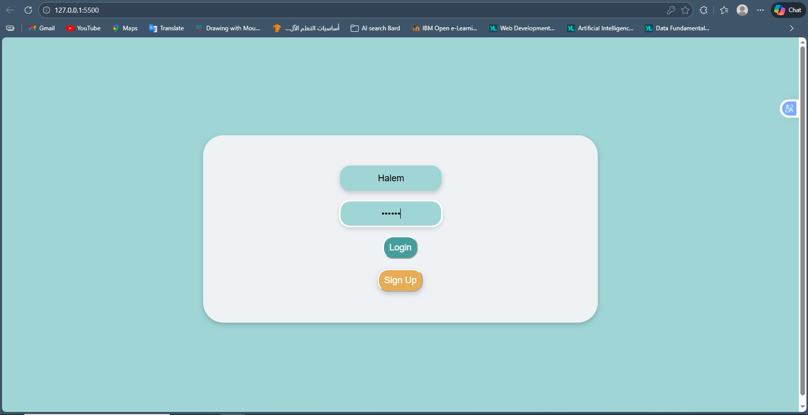
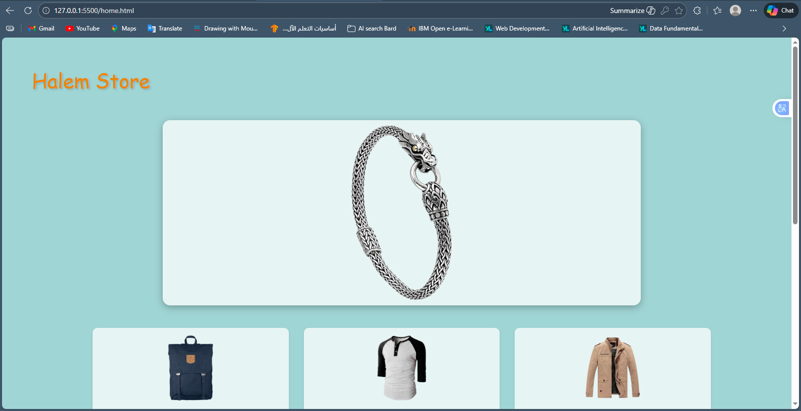
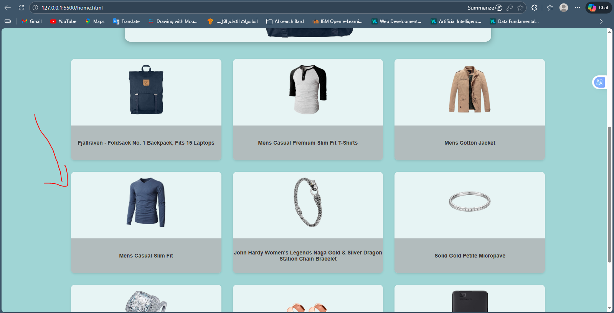
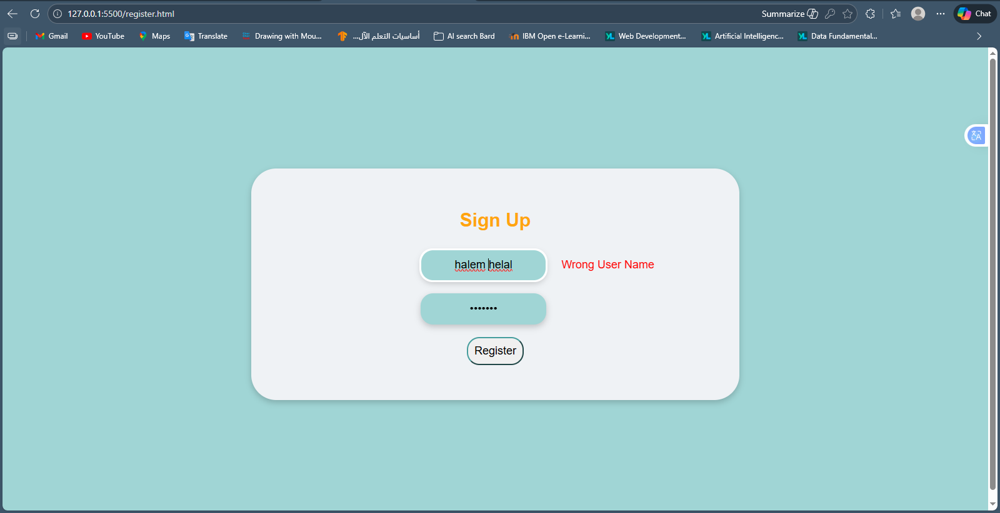

# 🛍️ Halem Store - E-Commerce Platform

A modern, responsive e-commerce web application built with vanilla HTML, CSS, and JavaScript. This project showcases a complete shopping experience with user authentication, product browsing, and detailed product views.

---

## 📋 Table of Contents

- [Features](#features)
- [Project Structure](#project-structure)
- [Technologies Used](#technologies-used)
- [Installation & Setup](#installation--setup)
- [Pages Overview](#pages-overview)
- [API Integration](#api-integration)
- [Key Features Explained](#key-features-explained)
- [Screenshots](#screenshots)

---

## ✨ Features

✅ **User Authentication**
- Login system with cookie-based credential storage
- User registration with validation
- Password and username validation using regex patterns

✅ **Product Catalog**
- Display 9 featured products in a responsive grid layout
- Click any product card to view details
- Auto-rotating product slider
- Real-time data fetching from Fake Store API

✅ **Product Details**
- Individual product detail pages
- Product information including:
  - Product image
  - Title and description
  - Category
  - Price
  - Rating
- Navigation between home and product pages

✅ **User Experience**
- Smooth animations and hover effects
- Responsive design for different screen sizes
- Clean and intuitive interface
- Local storage for product selection tracking

---

## 📁 Project Structure

```
Final_Project/scripts/
├── index.html          # Login page
├── register.html       # Registration page
├── home.html          # Product catalog page
├── product.html       # Product details page
├── index.js           # Main JavaScript logic
├── style.css          # All styling
├── CookiesLib.js      # Cookie management utilities
└── README.md          # This file
```

---

## 🛠️ Technologies Used

| Technology | Purpose |
|-----------|---------|
| **HTML5** | Semantic markup and structure |
| **CSS3** | Layout, styling, and animations (Flexbox, Grid) |
| **JavaScript (ES6)** | DOM manipulation, API calls, event handling |
| **Fetch API / XMLHttpRequest** | Async data loading from API |
| **localStorage** | Client-side data persistence |
| **Cookies** | User session management |
| **Fake Store API** | Product data source |

---

## 🚀 Installation & Setup

### Prerequisites
- Modern web browser (Chrome, Firefox, Safari, Edge)
- Local server (Live Server, Python http.server, etc.)

### Steps

1. **Clone or download the project**
   ```bash
   git clone <repository-url>
   cd Final_Project/scripts
   ```

2. **Start a local server**
   - Using Live Server (VS Code extension): Right-click `index.html` → "Open with Live Server"
   - Using Python: `python -m http.server 5500`
   - Using Node.js: `npx http-server`

3. **Open in browser**
   ```
   http://localhost:5500
   ```

---

## 📄 Pages Overview

### 1. **Login Page** (`index.html`)
- User credential verification against stored cookies
- Email and password validation
- Navigation to registration or home page
- Error messages for invalid credentials

```
┌─────────────────────────┐
│   Halem Store Logo      │
├─────────────────────────┤
│   Username Input        │
│   Password Input        │
│   [Login] [Sign Up]     │
└─────────────────────────┘
```

### 2. **Registration Page** (`register.html`)
- New user account creation
- Regex validation:
  - Username: Letters only (A-Z, a-z)
  - Password: Must contain uppercase letter + special character
- Cookie storage for user credentials
- Redirect to login after successful registration

### 3. **Home Page** (`home.html`)
- Header with "Halem Store" branding
- Auto-rotating product slider (3-second interval)
- 3x3 grid of product cards
- Click any product card to view details
- Responsive layout with Flexbox and Grid

```
┌─ Halem Store ────────────────┐
│  ┌───────────────────────────┐│
│  │   [Product Slider Image]   ││
│  └───────────────────────────┘│
│                               │
│  ┌─────┐ ┌─────┐ ┌─────┐    │
│  │ Img │ │ Img │ │ Img │    │
│  │Name │ │Name │ │Name │    │
│  └─────┘ └─────┘ └─────┘    │
│  ┌─────┐ ┌─────┐ ┌─────┐    │
│  │ Img │ │ Img │ │ Img │    │
│  │Name │ │Name │ │Name │    │
│  └─────┘ └─────┘ └─────┘    │
│  ┌─────┐ ┌─────┐ ┌─────┐    │
│  │ Img │ │ Img │ │ Img │    │
│  │Name │ │Name │ │Name │    │
│  └─────┘ └─────┘ └─────┘    │
└──────────────────────────────┘
```

### 4. **Product Details Page** (`product.html`)
- Back button (`<`) to return to home
- Product image (left side)
- Product information (right side):
  - Title
  - Category
  - Price (highlighted)
  - Rating
  - Description
- Amazon-style layout

```
┌─────────────────────────────────────────────┐
│ < Halem Store                               │
├─────────────────────────────────────────────┤
│ ┌──────────────┐   ┌──────────────────────┐│
│ │              │   │ Product Title        ││
│ │              │   │ Category: men's...   ││
│ │   Product    │   │ Price: $15.99        ││
│ │    Image     │   │ Rating: 4.5/5        ││
│ │              │   │ Description: Lorem.. ││
│ │              │   │                      ││
│ └──────────────┘   └──────────────────────┘│
└─────────────────────────────────────────────┘
```

---

## 🌐 API Integration

### Fake Store API
- **Endpoint**: `https://fakestoreapi.com/products`
- **Method**: GET
- **Response**: Array of product objects with:
  - `id`: Product identifier
  - `title`: Product name
  - `price`: Product price
  - `description`: Product details
  - `category`: Product category
  - `image`: Product image URL
  - `rating`: Object containing `rate` and `count`

### Implementation
```javascript
function GetProducts(callback) {
    let url = "https://fakestoreapi.com/products";
    let xhr = new XMLHttpRequest();
    xhr.open('GET', url);
    xhr.send("");
    xhr.onreadystatechange = function() {
        if(xhr.readyState === 4 && xhr.status === 200) {
            let data = JSON.parse(xhr.responseText);
            if(callback) callback(data);
        }
    }
}
```

---

## 🎯 Key Features Explained

### 1. **User Authentication Flow**
```
Register Page → SetCookie(username, password, 7 days)
                        ↓
            Login Page → Verify with GetCookie()
                        ↓
                    Home Page
```

### 2. **Product Navigation**
```
Home Page (Click Card) → Store Index in localStorage
                              ↓
                    Product Page → Fetch API
                                     ↓
                    Display Product Details
```

### 3. **Session Management**
- Uses browser **localStorage** to store selected product index
- Uses **Cookies** (via CookiesLib.js) to store user credentials
- Session persists across page navigation within the same session

### 4. **Responsive Design**
- **Mobile**: Single column layout
- **Tablet**: 2-column grid
- **Desktop**: 3-column grid with full slider
- Uses CSS Grid and Flexbox for layouts

### 5. **Animations**
- Slider rotates every 3 seconds
- Product cards have hover effects (translateY animation)
- Smooth transitions for all interactive elements

---

## 📸 Screenshots

### Login Page


### Home Page - Product Catalog


### Home Page - Product Grid


### Product Details Page


### Registration Page


---

## 📝 Usage Example

### 1. **First Time User**
1. Go to login page
2. Click "Sign Up" button
3. Enter username (letters only) and password (uppercase + special char)
4. Click "Register"
5. You're redirected to login page
6. Enter your credentials and login
7. View product catalog on home page

### 2. **Browse Products**
1. Home page displays 9 products
2. Watch the slider auto-rotate products
3. Click any product card to view details
4. Click `<` button to return to home

### 3. **Data Flow**
```
User Input → Validation → API Call → localStorage/Cookie 
    ↓
Display Data → User Interaction → Navigation
```

---

## 🔐 Security Notes

⚠️ **This is a demo project!** Not for production use:
- Passwords stored in plain text in cookies
- No backend validation
- No HTTPS enforcement
- Credentials visible in browser storage

For production:
- Use secure backend authentication
- Implement OAuth/JWT
- Use HTTPS only
- Hash passwords with bcrypt/Argon2
- Store credentials server-side

---

## 🐛 Known Limitations

- Only displays first 9 products from API
- No pagination or filtering
- No shopping cart functionality
- No payment integration
- Limited to 7-day cookie expiry
- No user profile management

---

## 🚀 Future Enhancements

- [ ] Add shopping cart functionality
- [ ] Implement product filtering and search
- [ ] Add pagination for product list
- [ ] Create user profile page
- [ ] Add wishlist feature
- [ ] Integrate payment gateway
- [ ] Add order history
- [ ] Implement backend API
- [ ] Add admin dashboard
- [ ] Mobile app version

---

## 📞 Support

For issues or questions:
1. Check browser console for errors (F12)
2. Verify API endpoint is accessible
3. Clear localStorage and cookies if experiencing issues
4. Ensure you're using a modern browser

---

## 📄 License

This project is open source and available under the MIT License.

---

## 👨‍💻 Developer

Created as an ITI (Information Technology Institute) Final Project

**Technologies**: HTML5, CSS3, JavaScript (ES6)

**Learning Outcomes**:
- DOM Manipulation
- Asynchronous Programming (XHR, Callbacks)
- Event Handling
- Local Storage & Cookies
- API Integration
- Responsive Web Design
- CSS Flexbox & Grid
- Form Validation

---

## 🎨 Design Inspiration

- **Color Scheme**: Teal and orange (modern e-commerce)
- **Layout**: Amazon-style product display
- **Typography**: Clean and readable fonts
- **User Experience**: Intuitive navigation

---

**Last Updated**: December 17, 2025

